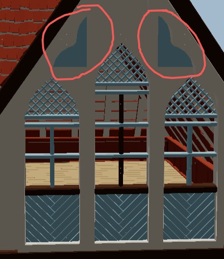
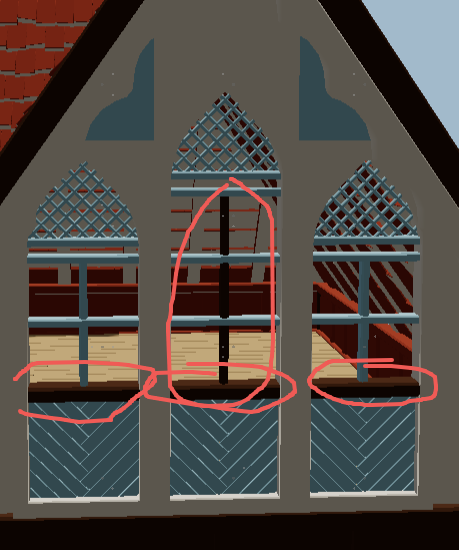
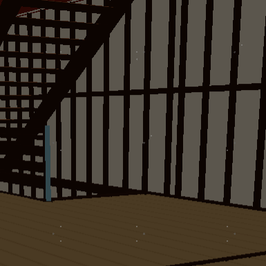
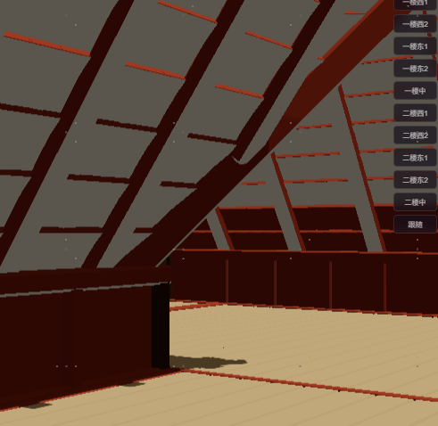
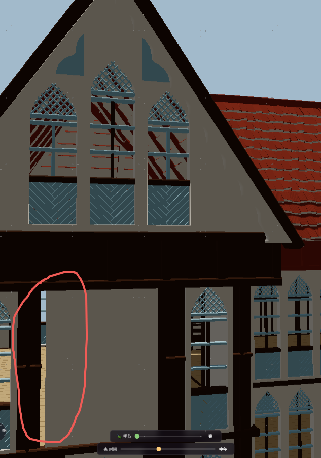
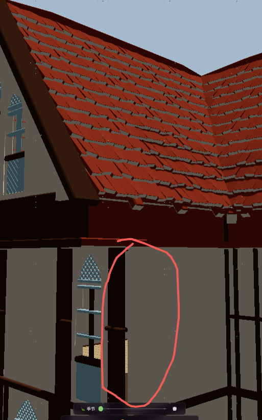

1  图片中被标记的部分 不应该是蓝色的 而是和山墙是白色的
2. 所有的窗户 你会发现这些窗户是没有玻璃的 所以不应该蓝色的 而是窗框的颜色
3. 有些窗户会有竖着或者横着的一个木头是黑色的  横着的我可以理解 是窗台  但是也是有的有 有的没有 你要统一一下 但是竖着的这个 就是窗框的一部分 搞个其他颜色真的很奇怪诶
4.  这是一楼二楼内部的场景 可以看到 竖梁在屋内也是黑色 不对哦 竖梁在屋内应该和墙一个颜色
5. 这是阁楼一叫 墙面和天花板红红白白黑黑 统一成一种内墙面色
6.  这是正面 这为什么有一道缝可以看见屋子里？ 
7.  这里为什么也有一道缝！！！！！可以看到屋子里
8. 需要把摄像头分类放 这么放太长还不容易找到想要的相机 相机需要在英文模式下变成英文
9. 把整个岛都用建模来做（一个建模文件） 但还是原来的尺寸大小 我需要人物能够站在岛上 并且走来走去 就和现在的平面一样 目前你可以先只在岛上放几棵树 意思一下 这几棵树需要能够四季变换
10. 建模之后 你参考 [text](doc/blender-workflow-instructions.md)[text](doc/design-surface-system.md)[text](doc/npr-pipeline.md)这几个文件设置人物的行动 注意一个很重要的问题 就是人物要能够上楼梯 
